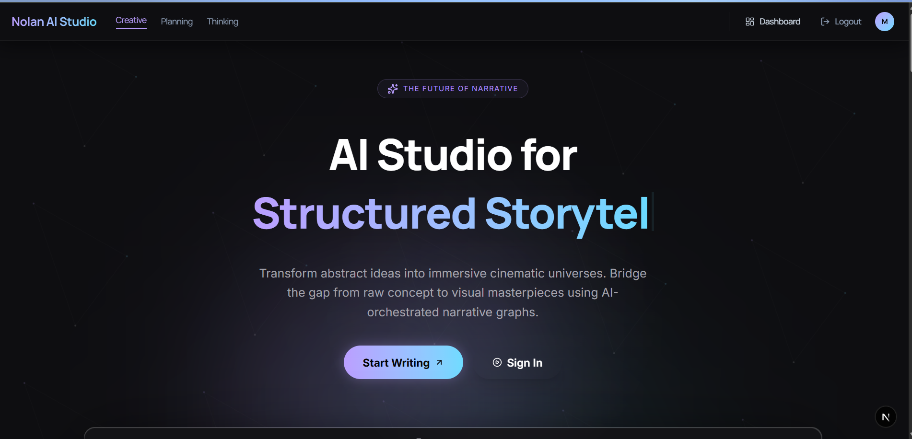
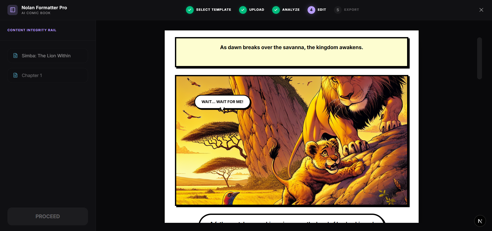

<div align="center">


# 📌 Nolan AI Studio




**An AI co-writer with a memory of your story.**

Long-form fiction writing tool that pairs real-time ghost-text suggestions with a
dual-RAG retrieval pipeline and a live Neo4j knowledge graph — so every suggestion
is grounded in what you've actually written, not a hallucinated guess.

</div>

---

## The problem

Generic AI writing tools are stateless. Ask ChatGPT to continue your novel at
page 200 and it has no idea what happened on page 40 — it forgets character
traits, invents locations you never wrote, contradicts your own plot. That's
fine for a paragraph; it falls apart across a 90,000-word manuscript.

Nolan Editor keeps a running model of the story as you write it — narrative
embeddings, a stylistic fingerprint of your voice, and a character/location
graph — and feeds all three into every suggestion, so continuity survives
past chapter one.

## What it does

- **Ghost text** — inline, token-streamed continuations as you type, toggleable
  per-scene, gated on a minimum context length so it never fires on empty prose.
- **Dual-RAG grounding** — a *narrative* retriever pulls relevant prior scenes
  from `pgvector`; a *DNA* retriever matches a stylistic fingerprint extracted
  from a reference story you upload, so output sounds like you, not like GPT.
- **Knowledge graph** — every scene is parsed for characters, locations, and
  relationships (`APPEARS_IN`, `INTERACTS_WITH`, `TAKES_PLACE_AT`) and written
  into Neo4j, rendered as an interactive, draggable graph canvas.
- **Scene linter** — on-demand LLM pass that catches repeated words, tense
  drift, and telling-vs-showing, with inline accept/reject suggestions.
- **Neural analytics** — background BERT sentiment/emotion classification and
  zero-shot narrative-arc detection per scene, visualized on a dashboard.
- **Comic pipeline** ("Nolan Formatter Pro") — turns a chapter into a
  structured comic: script breakdown → panel layout → AI-generated art →
  speech bubbles, in a guided 5-step wizard.
- **Animatic pipeline** — script extraction → TTS narration → assembled video,
  for pitching a scene before committing to full production.

### The comic pipeline, in the editor

<div align="center">
  
</div>

---

## Stack

**Frontend**
- Next.js 16 (App Router) + `pnpm`
- Tailwind CSS + `shadcn/ui`
- Tiptap 3 (ProseMirror) with custom ghost-text and linter extensions
- `framer-motion`, `recharts`, `@xyflow/react` (graph canvas)

**Backend**
- FastAPI + uvicorn (Python 3.11), fully async
- Supabase (Postgres + `pgvector` + auth), Redis cache, Neo4j graph
- spaCy `en_core_web_lg` (NER + SVO extraction), BERT sentiment/emotion,
  DistilBART zero-shot arc detection
- `sentence-transformers` embeddings into `pgvector` for the dual-RAG retriever
- LangChain streaming over the OpenAI API — every LLM and image call
  (ghost text, chat, linter, comic, animatic, avatars) runs through one
  shared client on a single `OPENAI_API_KEY`

## Architecture at a glance

```
Editor (Tiptap)  ──WebSocket──▶  FastAPI  ──┬─▶ Supabase (projects, scenes, auth)
                                             ├─▶ Redis (hot-read cache)
                                             ├─▶ Neo4j (character/location graph)
                                             └─▶ OpenAI (ghost text, chat, linter, images)

Scene saved ─▶ NLP pipeline (spaCy + BERT) ─▶ pgvector embeddings + graph write
                                                        │
Ghost text request ─▶ narrative RAG + DNA RAG ◀─────────┘
                    ─▶ prompt assembly ─▶ OpenAI stream ─▶ editor
```

---

## Running it locally

Two processes: FastAPI on `:8000`, Next.js on `:3000`. Start the backend
first — the frontend hits it on mount and opens a WebSocket immediately.

**Prerequisites:** Node ≥ 20.9, `pnpm`, Python 3.11.

**1. Database** — apply the SQL in `backend/migrations/` through the
Supabase SQL editor, in order: `db.sql` first (it creates the tables
everything else references), then `db_migrations.sql` → `_v2` … `_v8`, then
`create_project_videos.sql`.

**2. Backend**

```bash
cd backend
python -m venv .venv
.venv\Scripts\activate          # Windows; source .venv/bin/activate elsewhere
pip install -r requirements.txt
python -m spacy download en_core_web_lg
```

Create `backend/.env` with at least `SUPABASE_URL`, `SUPABASE_ANON_KEY`, and
`OPENAI_API_KEY` (Redis and Neo4j are optional — the app degrades gracefully
without them). Then:

```bash
python app.py
```

First boot pre-loads four ML models and takes a few minutes; wait for
`Server ready`. Smoke test at `http://localhost:8000/health`.

**3. Frontend**

```bash
cd frontend
pnpm install
pnpm dev
```

Create `frontend/.env` with `NEXT_PUBLIC_API_URL`, `NEXT_PUBLIC_WS_URL`, and
your Supabase public keys. Open `http://localhost:3000`.

Full setup detail — every environment variable, migration order, and a
troubleshooting table — lives in [`AGENTS.md`](AGENTS.md).

---

## Project layout

```
frontend/   Next.js app — landing page, dashboard, project wizard, editor
backend/    FastAPI service
  routers/    REST + WebSocket endpoints
  services/   NLP, BERT, RAG, LLM, graph, images, comic, animatic
  lib/        Supabase / Redis / Neo4j clients, WS manager
  migrations/ SQL to apply in the Supabase SQL editor
example/    Static HTML prototypes used as design reference
```
